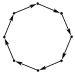

# 7505. Разорванное кольцо

## Решена | Легкая

— Осторожнее!

В санитамере от твоего носа неожиданно проносится поезд. Это что ещё такое?..

Проходящие вокруг в замешательстве: это поезд кольцевой линии, опоясывающей замок и город. Но как он оказался в самом центре?

Ты открываешь консоль управления железнодорожным графом — и всё становится ясно. Для починки системы необходимо решить задачу.

Даны ориентированный граф из `n` вершин, заданный массивом `a` из `n` целых чисел:
- Для каждого `i (1 ≤ i ≤ n)` есть ребро из вершины `i` в вершину `a_i`.
- Массив `a` является перестановкой.

Ваша задача — минимально стоимость изменить перестановку `a` таким образом, чтобы весь граф представлял собой ориентированный граф-цикл.

Также данный массив `a` из `n` целых чисел.

Пусть исходный массив `a` после всех изменений равен массиву `b`, тогда стоимость равна `∑|b_i - a_i|`, то есть сумме всех `|b_i - a_i|` для которых верно `a_i ≠ b_i`.

### Формат ввода

Каждый тест состоит из нескольких наборов входных данных. Первая строка содержит количество наборов входных данных `t (1 ≤ t ≤ 4 · 10^4)`. Далее следует описание наборов входных данных.

Первая строка каждого набора входных данных содержит целое число `n (1 ≤ n ≤ 2 · 10^5)` — число вершин в графе.

Вторая и третья строки содержат по `n` целых чисел `a_1, a_2, ..., a_n (1 ≤ a_i ≤ n)` и `b_1, b_2, ..., b_n (0 ≤ b_i ≤ 10^9)`.

Гарантируется, что массив `a` является перестановкой длины `n`, а также что сумма `n` по всем наборам входных данных не превышает `2 · 10^5`.

### Формат вывода

Для каждого набора входных данных выведите одно целое число — минимальную стоимость, за которую можно изменить массив `a` таким образом, чтобы образуемый им граф был ориентированным граф-цикл.

## Примечание

### Определения

Перестановкой длины `n` называется массив, состоящий из `n` различных целых чисел от 1 до `n` в произвольном порядке. Например, `[2, 3, 1, 5, 4]` — перестановка, но `[1, 2, 2]` — не перестановка (`2` встречается дважды), а `[1, 3, 4]` — тоже не перестановка (`3` и `4` отсутствуют).

Ориентированным графом-циклом называется сильно связный ориентированный граф без кратных рёбер, состоящий ровно из одного цикла, и каждая из вершин которого имеет ровно одно входящее и одно исходящее ребро.

## Илюстрация

## Тестовые примеры

В первом и втором наборах массивы `a` уже образуют ориентированный граф-цикл, ничего менять не нужно.

В третьем и четвертом наборах можно показать, что необходимо изменить все `a_i`, так как массив `a` (после изменений) может быть равен `[2, 3, 1]`.

В пятом наборе один из оптимальных вариантов `a = [2, 3, 4, 5, 6, 1]`.

---

## Ограничения

- Ограничение времени: 2с
- Ограничение памяти: 256 Мб

---

## Пример 1
**Ввод:**  
5
1
1
2
4
2 3 4 1
4 2 5 5
3
1 2 3
5 4 7
3
1 2 3
0 0 0
6
2 3 1 5 4 6
1 1 1 1 1 2

**Вывод:**  
0
0
16
0
4

---